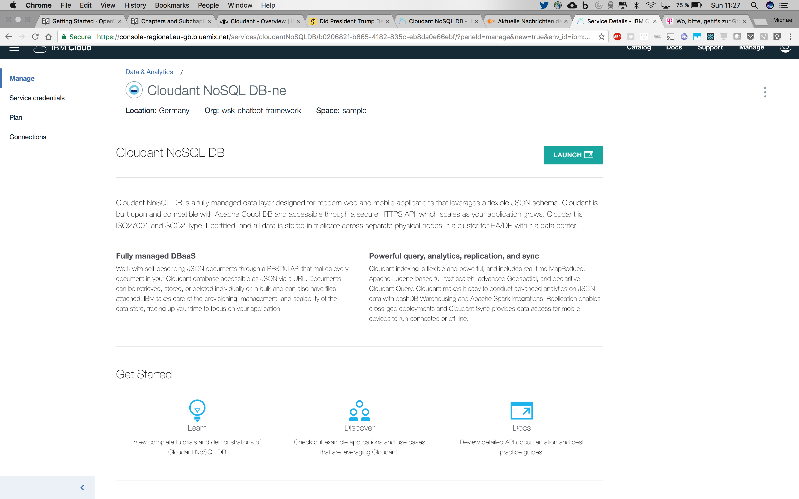
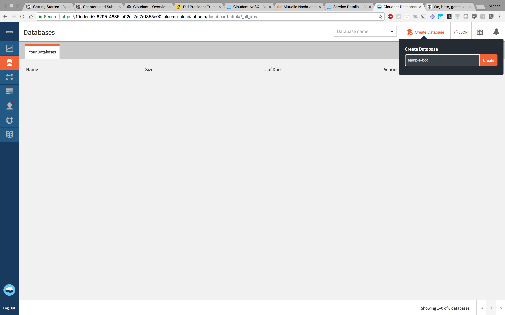
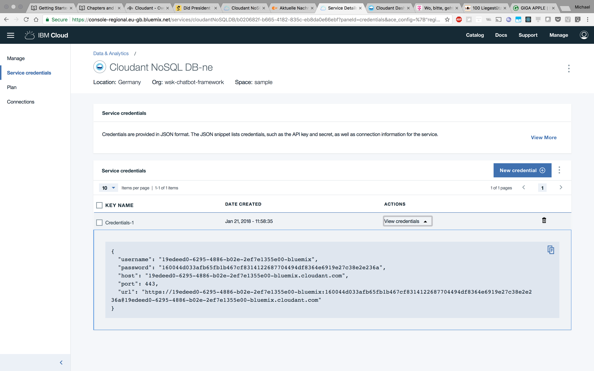

# Persistence

Often you want your bot to keep the status of a conversation over multiple sessions; or you want to enable your bot to use the same conversation context for multiple channels, so that your user can communicate with different channels within the same long-running conversation.

Persistence for the OpenWhisk Chatbot Framework can be configured by adding additional middleware actions to your bot's processing pipeline. The following default actions are provided:

  * **middleware-user-load** and **midleware-user-persist**. These to actions can be added to the beginning or the end of the pipeline to load user profile data into your application and store it back into the database.

  * **middleware-context-load** and **middleware-context-persist**. Adding these actions to the pipeline allows you to store the conversation context in the database. Both actions can only be used if `middleware-user-load` is used earlier in the pipeline.

  * **middleware-payload-persist**. Persists the payload of the processing pipeline. This can be used to analyze the behaviour of your bot.

All persistence actions are built on top of [IBM Cloudant](https://www.ibm.com/cloud/cloudant). Thus, to extend your actions you first need an instance of IBM Cloudant.

## Database Setup

Before you can begin to work with persistence actions, you need to taka a few steps to setup the database. If you don't have an existing IBM Cloudant instance, you can provision a free instance on [IBM Cloud](https://console.bluemix.net/catalog/services/cloudant-nosql-db).

When you have created or opened a new service instance you can launch the administrative dashboard via the IBM Cloud dashboard



Within the administrative dashboard, create a new database with the name of your choice. To continue extending our Getting Started bot, we'll use `simple-bot` as the database name.



This would be already enough to work with the database; But, to improve performance of searches in the database it's recommended to also setup a few indexes.

## Database Configuration

As shown in [Getting Started](../getting-started/README.md), the `package.parameters.json` is the central point of configuration for the OpenWhisk Chatbot Framework. Thus you also need to add the connection parameters to `package.parameters.json`:

```json
{
  "config": {
    "cloudant": {
      "database": "THE NAME OF THE DATABASE",
      "url": "THE CONNECTION URL FOR THE DATABASE"
    }
  }
}
```

The `url` parameter should already contain your username and password. You can get the `url` parameter from the Credentials tab on the service dashboard of your Cloudant instance in IBM Cloud.



## Adding persistence middleware actions

As described above, OpenWhisk Chatbot framework already includes four actions to load and persist user data and conversation data. You can simply add those actions to the middleware configuration of your bot within your `package.parameters.json`. Just be aware of the order: `middleware-context-load` cannot be executed before `middleware-user-load`.

To extend our Getting Started bot with persistence, we configure the middleware as follows:

```json
{
  "config": {
    "middleware": [
      {
        "action": "middleware-user-load"
      },
      {
        "action": "middleware-context-load"
      },
      { 
        "action": "middleware-services-wcs",
        "parameters": {
          "endpoint": "https://gateway-fra.watsonplatform.net/conversation/api",
          "workspace": "70bfb122-29c5-4221-bd5b-d898090edxxx",
          "username": "2c15dcf2-e8be-4bc6-84e0-518f885b5xxx",
          "password": "swordfish"
        }
      },
      {
        "action": "middleware-output-send"
      },
      {
        "action": "middleware-user-persist"
      },
      {
        "action": "middleware-context-persist"
      }
    ]
  }
}
```

This will enable your bot to store the context in your database.

**Keep in mind:** After you have updated `package.parameters.json`, don't forget to update your package binding:

```bash
$ cd /your/directory/with/package.parameters.json
$ wsk package delete sample-bot
ok: deleted package sample-bot
$ wsk package bind /wsk-chatbot-framework_prod/v1 sample-bot -P package.parameters.json
ok: created binding sample-bot
```

## Behind the scenes

Again let's take a look what's happenning when running these actions. The action `middleware-user-load` will use the user ide provided by the input-connector to lookup a user with this id for the executed channel. This mechanism allows OpenWhisk Chatbot Framework maintain the same user profile for multiple channels. If the user profile does not exist, `middleware-user-load` creates a new profile. If the active channels has configured a `-newuser` action, this action will be called to create the initial profile. E.g. the `channels-facebook-newuser` action will expand the user profile with the data available on the users Facebook profile (firstname, lastname, hometown, etc.).

The user data is stored within the processing payload at `conversationcontext.user`, a simple user profile might look like:

```bash
{
  "user": {
    "_id": "The internal user id",
    "facebook_id": "The user id for the facebook channel",
    "firstname": "Egon",
    "lastname": "Olsen"
  }
}
```

When `middleware-user-load` has loaded the detailed user information into the processing payload, `middleware-context-load` can use these information to load the conversation context. The conversation context is stored in the database by using the internal user id (`user._id`). The conversation context may include all information you want to store between all requests and sessions. For example `middleware-services-wcs` is storing the Watson Conversation Service context within the conversation's context. Thus if you use the persistence actions and the `middleware-services-wcs` actions together; everything is already in place to keep the required information in the database.

In your custom actions you can store whatever you want within the payloads `conversationcontext` key. Everything within this object will be persisted to the database when calling `middleware-context-persist` - Except the user information within `conversationcontext.user`. If you want to store this data in the database you need to call `middleware-user-persist`.

## Summary

As described above; OpenWhisk Chatbot Framework offers already the base functions to manage your bot's data in a database. You don't need to rely on that if you want to use another database system than IBM Cloudant. 