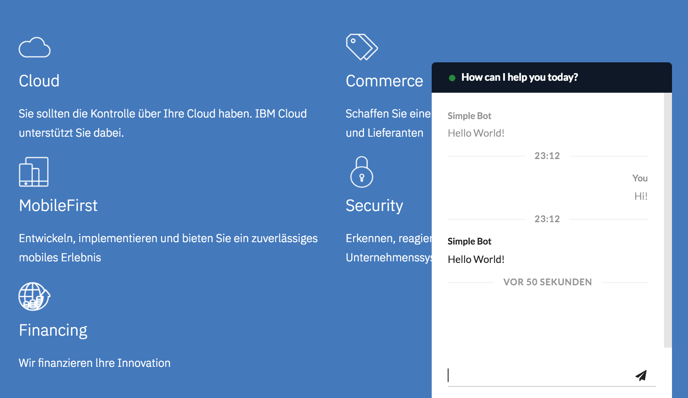
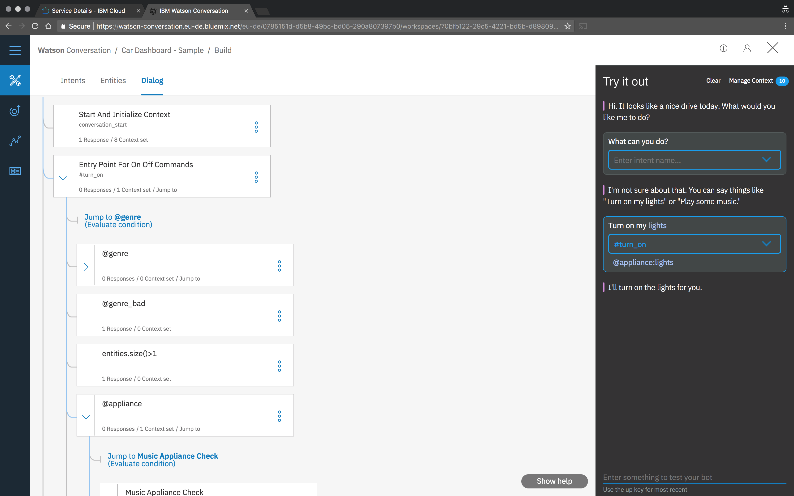
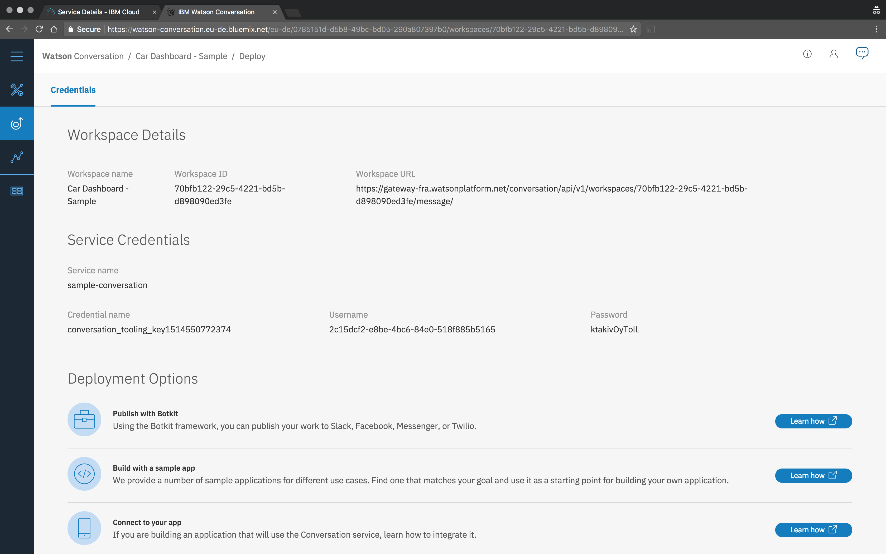

# Basics

Building simple chatbots is quite easy; building complex chatbots with many integrations, channels and services is harder. But don't be fooled - Getting started with OpenWhisk Chatbot Framework is incredibly simple, even though it enables you to extend your chatbot with many functions easily. 

To get started without struggle, you should bring some basic skills of Apache OpenWhisk with you, as well as an instance of OpenWhisk which you can use. This can be a self hosted or a free available, e.g. [IBM Cloud Functions](https://console.bluemix.net/openwhisk). For the examples we'll use the [OpenWhisk CLI](https://github.com/apache/incubator-openwhisk-cli). If you haven't installed and if you are using IBM Cloud, you can download it from here: [https://console.bluemix.net/openwhisk/learn/cli](https://console.bluemix.net/openwhisk/learn/cli).

The guide will introduce you step by step into the most important components of OpenWhisk Chatbot Framework by building a chatbot; starting simple, becoming more advanced.

## The "Hello World!" Bot

Let's start with a quite simple one: The classical "Hello World!" example.

**package.parameters.json** is the single configuration file to configure the functionality and behaviour of the bot. For our "Hello World!" example, in an empty directory of your choice, create a file called `package.parameters.json` with the following content:

```json
{
  "config": {
    "connectors": {
      "http": {
        "input": {
          "action": "channels-http-input"
        },
        "output": {
          "action": "channels-http-output"
        }
      }
    },
    "middleware": [
      { 
        "action": "middleware-static-message",
        "parameters": {
          "message": "Hello World!"
        }
      },
      {
        "action": "middleware-output-send"
      }
    ],
    "openwhisk": {
      "package": "sample-bot"
    }
  }
}
```

We'll have a close look soon to the contents of this file. For now just continue on the terminal and create an [OpenWhisk package binding](https://github.com/apache/incubator-openwhisk/blob/master/docs/packages.md#creating-and-using-package-bindings) with `package.parameters.json`:

```bash
$ cd /your/directory/with/package.parameters.json
$ wsk package bind /wsk-chatbot-framework_prod/v1 sample-bot -P package.parameters.json
ok: created binding sample-bot
```

**core-input** is an OpenWhisk action provided by the OpenWhisk Chatbot Framework which acts as the central entrypoint for all messages received via any channel. This action needs to be provided as [OpenWhisk web action](https://console.bluemix.net/docs/openwhisk/openwhisk_webactions.html) to make your chatbot accessible. To expose the action via HTTP(S), execute the following commands

```bash
$ wsk package create sample-bot-api
ok: created package sample-bot-api

$ wsk action create sample-bot-api/core-input \
  --sequence sample-bot/core-input \
  --web true
ok: created action sample-bot-api/core-input
```

Believe it or not. You're done with the first very simple "Hello World" bot. To test your bot, call it via `curl`:

```bash 
$ curl https://<openwhisk_endpoint>/api/v1/web/<your_namespace>/sample-bot-api/core-input?message=Hello

# For example:
$ curl https://openwhisk.eu-de.bluemix.net/api/v1/web/wsk-chatbot-framework_sample/sample-bot-api/core-input?message=Hello
{
  "messages": [
    "Hello World!"
  ],
  "conversationcontext": {}
  "context": {}
}
```

*Note: The first call might take a few seconds as OpenWhisk needs to prepare everything. On the next call, all the actions will be warmed up and the response will be presented much faster. Try it out.*

## Connect a User Interface

Before we continue to extend the bot's features we'll connect the bot to a user interface. Our first "Hello World" bot is accessible through a simple REST API, which also can be called from client-side JavaScript. An easy to integrate client UI can be found in this GitHub repository: [github.com/cokeSchlumpf/web-chatclient](https://github.com/cokeSchlumpf/web-chatclient).

Let's clone and customize the example to connect it to our OpenWhsik Chatbot Framework bot.

```bash
$ git clone git@github.com:cokeSchlumpf/web-chatclient.git
```

Open `build/index.ocf.html` and edit the following lines by replacing the variable values with your specific values (all the values are contained in the `curl` above).

```javascript
var openwhisk_endpoint = "openwhisk.eu-de.bluemix.net";
var openwhisk_namespace = "wsk-chatbot-framework_sample";
var openwhisk_package = "sample-bot-api"
```

Now you can provide the sample UI with an HTTP server, e.g.

```bash
# within the repository
$ cd build
$ python -m SimpleHTTPServer
```

This will provide you a sample web page with a chat window on [localhost:8000/index.ocf.html](http://localhost:8000/index.ocf.html). This [Web ChatClient UI](https://github.com/cokeSchlumpf/web-chatclient) can also be integrated in any existing UI.



## Extend with IBM Watson Conversation Service

Let's make our bot a little bit more fancy. [IBM Watson Conversation Service](https://www.ibm.com/watson/services/conversation/) enables you to create applications that understand natural-language and responds in human-like conversations. With OpenWhisk Chatbot Framework it's easy to extend these conversations with additional custom logic and bind the conversation to multiple channels.

First we need an IBM Watson Conversation workspace that we can use to integrate in our Bot. There are many tutorials around on how to create a conversation with IBM Watson Conversation, e.g.

  * [Build a chatbot in ten minutes with Watson](https://www.ibm.com/blogs/watson/2016/12/build-chat-bot/)
  * [Watson Conversation Service - Getting Started](https://console.bluemix.net/docs/services/conversation/getting-started.html#gettingstarted)

or if you prefer a video:

  * [Build a bot in 6 minutes with IBM Watson Conversation](https://www.youtube.com/watch?v=ykFhCjkGWxA)

To cotinue integrating a Watson Conversation bot into OpenWhisk Chatbot framework we'll use the default example "Car Dashboard" you can find on every newly created workspace; but you can use any other conversation you have built.



To configure your workspace within OpenWhisk Chatbot Framework, we need the values available on the `Deploy` page of your Watson Conversation workspace:



Note the following values:

  * **Workspace ID**, e.g. 70bfb122-29c5-4221-bd5b-d898090edxxx
  * **Workspace URL** (just the API endpoint), e.g. https://gateway-fra.watsonplatform.net/conversation/api
  * **Username**, e.g. 2c15dcf2-e8be-4bc6-84e0-518f885b5xxx
  * **Password**

Now, we change our `package.parameters.json` to use Watson Conversation Service:

```json
{
  "config": {
    "connectors": {
      "http": {
        "input": {
          "action": "channels-http-input"
        },
        "output": {
          "action": "channels-http-output"
        }
      }
    },
    "middleware": [
      { 
        "action": "middleware-services-wcs",
        "parameters": {
          "endpoint": "https://gateway-fra.watsonplatform.net/conversation/api",
          "workspace": "70bfb122-29c5-4221-bd5b-d898090edxxx",
          "username": "2c15dcf2-e8be-4bc6-84e0-518f885b5xxx",
          "password": "swordfish"
        }
      },
      {
        "action": "middleware-output-send"
      }
    ],
    "openwhisk": {
      "package": "sample-bot"
    }
  }
}
```

Finally, to update the bot on OpenWhisk, re-create the OpenWhisk package for your bot with the new package parameters:

```bash
$ cd /your/directory/with/package.parameters.json
$ wsk package delete sample-bot
ok: deleted package sample-bot
$ wsk package bind /wsk-chatbot-framework_prod/v1 sample-bot -P package.parameters.json
ok: created binding sample-bot
```

Using the chat client, we can now do a chat with the conversation created within Watson Conversation Service. 


The OpenWhisk Chatbot Framework and the chat client are already handling the current conversationcontext, the state, of the conversation; thus we've created a fully functional simple chat bot with user interface without any coding yet; And, as we are using OpenWhisk Chatbot Framework, we can easily extend the functionality of the bot, e.g.

  * Use `middleware-context-load`, `middleware-context-persist` together with `middleware-user-load` and `middleware-user-persist` to add persistence to your bot. With this you would also be able to keep the conversation state over mutliple channels.

  * Add `channels-facebook-input` and `channels-facebook-output` connector actions to add [Facebook Messenger](https://www.messenger.com/) as an additional channel to your Bot.

  * To make the answers of your bot more flexible and/ or dependent on location, language or channel, use `middleware-output-transform-*` actions.

  * To build complex chatbots which combine multiple service providers or even mutliple conversation backends, use `middleware-patterns-fsm` or `middleware-patterns-fanout`

OpenWhisk Chatbot Framework offers a bunch of different middleware-actions to extend your chatbot. A compelte list can be found in the [Git Repository](https://github.com/cokeSchlumpf/openwhisk-chatbot-framework/tree/master/actions) (hopefully more HowTo-examples for them will be available soon ;)). Of course you can also create your own middleware- and connector-actions and configure them within the `package.parameters.json` file.

## Behind the scenes

As promised above we'll have a closer look on the details of what we created above. As mentioned, `package.parameters.json`, is the central configuration file for your bot with OpenWhisk Chatbot Framework.

With OpenWhisk Chatbot Framework a bot is composed out of actions. To build two types of actions are used:

  * **Connectors**. 
    Connectors are actions which integrate a bot with different channels. In the example above, we are using the synchronuous HTTP(S) channel. Connectors can provide synchronuous and asynchronous integration, e.g. the Facebook Messenger connector provided by the framework is asynchronuous. Usually a connector contains an `input`- and an `output`-action, in addition it is possible to define a `newuser`-action which might be called by `middleware-user-load` if it detects a new user.

  * **Middleware**
    Middleware actions are actions which are channel-agnostic, they're processing a request from any channel. In the example above we were using the `middleware-static-message`, `middleware-services-wcs` and `middleware-ouput-send`.

    Such actions can do various things like enriching your message by calling services, sending messages and actions to a client (e.g. sending a typing indicator action) and much more.

Connectors can be defined in `package.parameters.json` within the `connectors` section. E.g.

```json
{
  "config": {
    "connectors": {
      "http": {
        "input": {
          "action": "channels-http-input"
        },
        "output": {
          "action": "channels-http-output"
        }
      },
      "facebook": {
        "input": {
          "action": "channels-facebook-input"
        },
        "output": {
          "action": "channels-facebook-output"
        },
        "newuser": {
          "action": "channels-facebook-newuser"
        }
      }
    }
  }
}
```

A bot can have multiple connectors. Although a bot may have multipe connectors, it always just has one REST API endpoint which can be called to invoke the `core-input` action. This endpoint can be called with any path, any parameters, any HTTP method and any paylod; it is also possible to call core-input via a non-HTTP event (e.g. queue event, database event etc.).

```bash
curl https://openwhisk.eu-de.bluemix.net/api/v1/web/wsk-chatbot-framework_sample/sample-bot-api/core-input?message=Hello
```

When the core-input action is invoked, it calls each connector with the request. The request returns a valid result to initiate the chatbot pipeline or a signal that it's not responsible for the payload received. If `core-input` receives on valid payload from the connector, the processing pipeline is initialized. For asynchronuous connectors, `core-input` will imediately provide an response; for synchronuous connectors, `core-input` will await the result of the processing pipeline and return the response of the pipeline.

The processing pipeline is a sequence of middleware-actions which is executed, middleware-actions are defined in the `middleware` key of the configuration.

```json
{
  "config": {
    "middleware": [
      { 
        "action": "middleware-static-message",
        "parameters": {
          "message": "Hello World!"
        }
      },
      {
        "action": "middleware-output-send"
      }
    ]
  }
}
```

By default actions are executed in a sequence. If one action fails, the processing pipeline fails and processing stops. To handle errors properly, middlewares can have additional properties.

  * `async` - When `true` the middleware action is called asynchronuously, if an action is called asynchronuously it's result is not passed to the next middleware since the middleare will be directly called after invoking the asynchronuous middleware.

  * `catch` - When `true` the middleware action is executed if one of the preceeding actions was failing, if the `catch` action completes successfully, processing is continued as usual.

  * `final` - When `true` the middleware action is executed in any case, even if one of the preceeding actions was failing

  * `continue_on_error` - When `true` the following middlewares are executed, even if the middleware with that attribute failed

A more advanced middleware-configuration could look as follows:

```json
{
  "config": {
    "middleware": [
      { 
        "action": "middleware-services-wcs",
      },
      {
        "action": "my-own-package/my-custom-action",
        "properties": {
          "async": true
        }
      },
      {
        "action": "middleware-static-message",
        "properties": {
          "catch": true
        },
        "parameters": {
          "message": "Sorry, there was an error processing your message :("
        }
      },
      {
        "action": "middleware-output-send",
        "properties": {
          "final": true
        }
      }
    ]
  }
}
```

The action which is processing the pipeline is the action `core-middleware`. This action itself can be called as middleware. When combining the capabilities of `core-middleware`, `middleware-patterns-*` and custom actions you're able to build chatbots with much more advanced processing steps like in the examples above. 

## Summary

As we have seen above, with OpenWhisk Chatbot Framework it is possible to start a simple chatbot project quickly. But apart from other ways to quickstart a simple POC project, OpenWhick Chatbot Framework also gives you the ability to extend the bot with many possible features, channels and processing logic.

OpenWhisk Chatbot Framework is open source and licensed under Apache 2.0 license; Contributions and requests for improvements are very welcome.